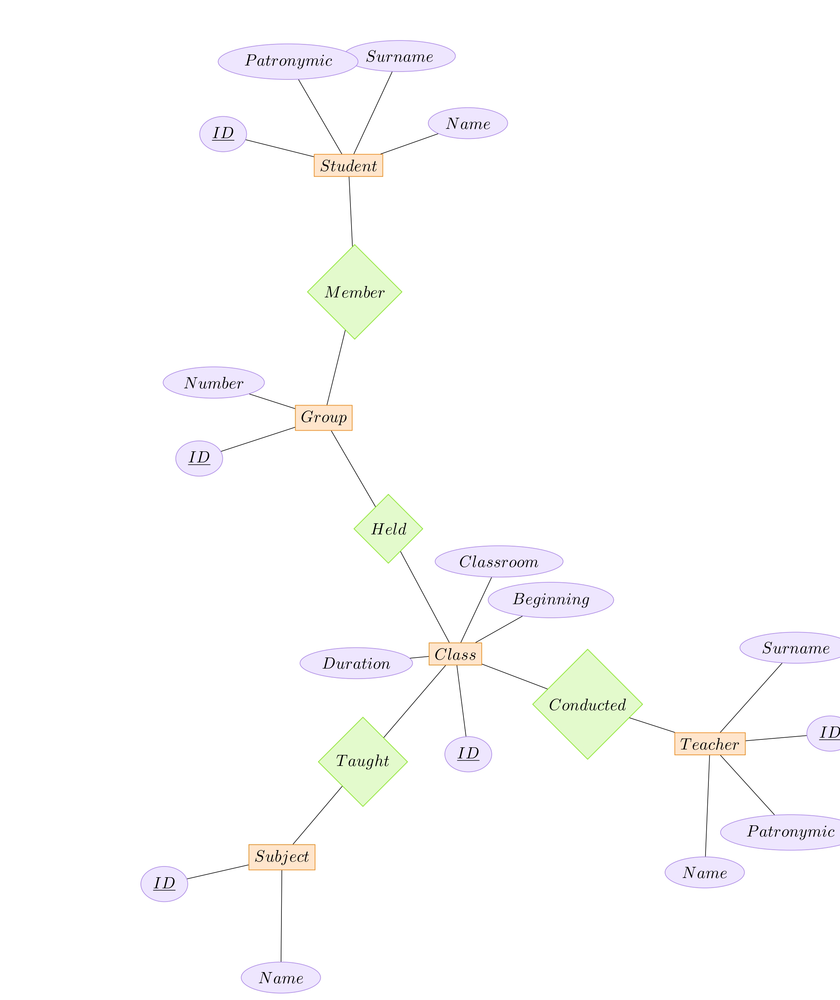
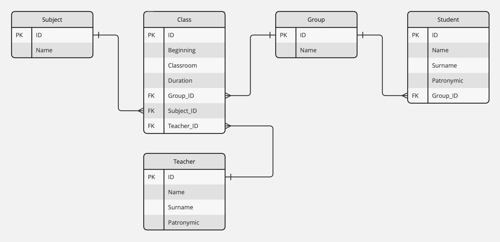

# Домашняя работа по графовым базам данных

### Обсуждение предметной области

В данной работе рассматривается расписание занятий студентов и преподавателей.

### Построение ER-диаграммы

На картинке ниже отображено следующее:

1) Сущности с атрибутами:

    a. **Student** - студент с атрибутами вида:  
        - **ID** - уникальный идентификатор студента.  
        - **Surname** - фамилия студента.  
        - **Name** - имя студента.  
        - **Patronymic** - отчество студента.  
    b. **Group** - студенческая группа с атрибутами вида:  
        - **ID** - уникальный идентификатор группы.  
        - **Number** - номер группы.  
    с. **Class** - занятие с атрибутами вида:  
        - **ID** - уникальный идентификатор занятия.  
        - **Classroom** - аудитория.  
        - **Beginning** - начало занятия.  
        - **Duration** - продолжительность занятия.  
    d. **Subject** - предмет с атрибутами вида:  
        - **ID** - уникальный идентификатор предмета.  
        - **Name** - название предмета.  
    e. **Teacher** - преподаватель с атрибутами вида:  
        - **ID** - уникальный идентификатор преподавателя.  
        - **Surname** - фамилия преподавателя.  
        - **Name** - имя преподавателя.  
        - **Patronymic** - отчество преподавателя.

2) Отношения:  
    a. **Member** - каждый студент является членом какой-то из групп, группа состоит из конкретных студентов.  
    b. **Held** - занятие проводится для какой-то группы, конкретная группа посещает занятие.  
    c. **Taught** - на занятии преподается какой-то предмет, конкретный предмет преподается на конкретном занятии.  
    d. **Conducted** - занятие проводится каким-то преподавателем, конкретный преподаватель проводит занятие.

### Построение диаграммы отношений

